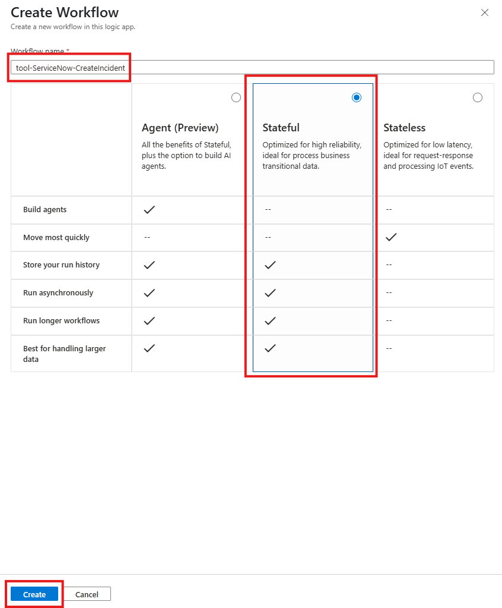
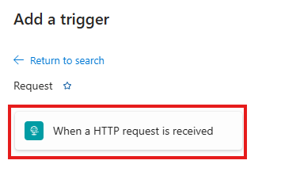
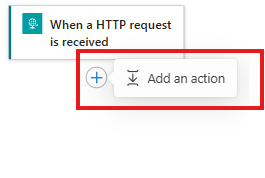
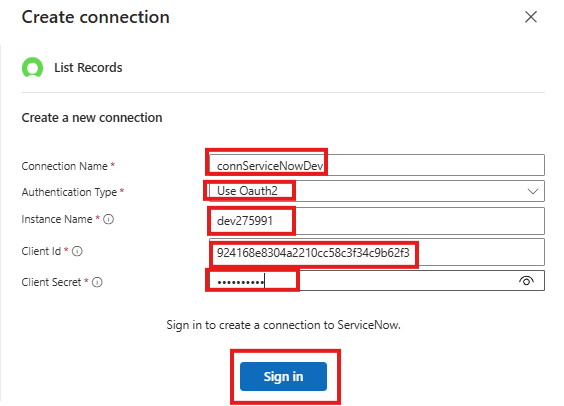
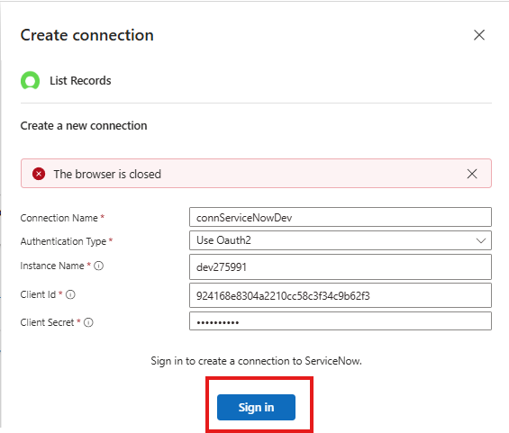
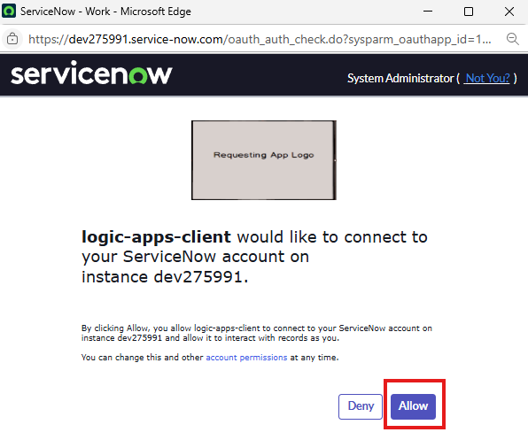
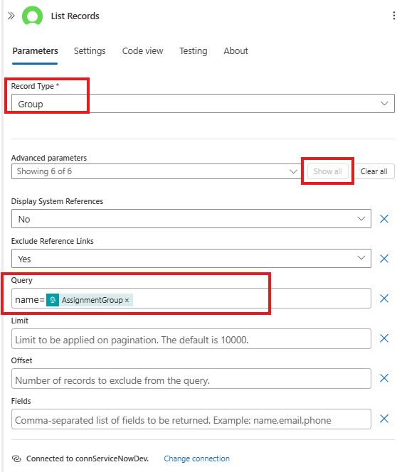

# Module 8: Create Tool - ServiceNow Create Incident
In this module we will create a stateful workflow to create a ServiceNow Incident. Our Agent Loop will leverage this workflow as a tool to create ServiceNow incidents when processing an event.


## Create Stateful Workflow

1. Create a new workflow:

    - Navigate to the  **Workflows -> Workflows**  section of your Logic app
    - Click `+ Add -> Add`

        

2. Create a new stateful workflow with:
    
    - **Workflow name:** `tool-ServiceNow-CreateIncident`
    - Select the radio button for the `Stateful` worflow type
    - Click `Create`

    

3. Open the worflow visual editor by clicking on the `tool-ServiceNow-CreateIncident` link

    

## Configure Workfow
1. Configure the workflow trigger to accept an HTTP Request
    - Click on `Add Trigger`
    - Select the `Request` action located in the **Built-in tools** group

        
        
    - Select the `When a HTTP request is received`

        

1. Configure the `When a HTTP request is recieved` action:
    - **Request Body JSON Schema**
        ```JSON
        {
            "type": "object",
            "properties": {
                "AssignmentGroup": {
                "type": "string"
                },
                "Description": {
                "type": "string"
                },
                "FailureDateTime": {
                "type": "string"
                },
                "ResolutionSteps": {
                "type": "string"
                },
                "Severity": {
                "type": "string"
                }
            }
        } 
       ```

1. Look up the internal identifier for the **Assignment Group** in ServiceNow. The Assignment Group is the group of the team that will be responsible for resolving the particular incident. By assigning, this value during ticket creation, we can ensure that it is assigned appropriately.

    - Add a new action. Click `+ Add an action`

        

    - Select the `ServeNow - List Records` action

        

1. Configure the `ServeNow - List Records` activity. 

    - Configure the Connection:
        - **Connection Name:** `connServiceNowDev`
        - **Authentication Type:** `Use Oauth2`
        - **Instance Name:**  [obtained from Module 2]
            - example: `devXXXXXX` 
            - can also be found in the url of you developer instance https://[instance name].service-now.com
        - **ClientId:**  [obtained from Module 2 - ]
            - example: 924168e8304a2210cc58c3f34c9b62f3
        - Click `Sign in` 

        

    - **NOTE** you **may** receive the following error. 

        

        If you receive this error you will need to:
        - Copy  the URL into a text editor
        - note the `redirect_uri` parameter in the querystring  
            - redirect_uri=https%3a%2f%2flogic-apis-canadacentral.consent.azure-apim.net%2fredirect
        - convert the URL Encoded ASCII characters back as follows
            - Replace %3a with :
            - Replace %2f with /
        - in the above example we would have resolved to https://logic-apis-canadacentral.consent.azure-apim.net/redirect 

            - Update the Application Registration entry created in the [Module 4 - Prequistes - ServiceNow setup](04_servicenow_dev_sandbox.md).
        Add the Redirect URL

        

    - Close the browser popup window
    - Click the `Sign In` button  again 
    
        
    
1. Click `Allow` granting Logic Apps permision to connect to your ServiceNow instance 

    

1. Configure the List Records Activity as follows
    - **Record Type:** `Group`
    - **Advanced Parameters** (click `Show all`)
    - **Query:** `name=@{triggerBody()?['AssignmentGroup']}`

    

1. Add a new action

1. Select the `ServiceNow - Create Record` action

    

1. Configure the Create Record action as follows:
    - **Record Type:** `Incident`
    - **Advanced Parameters:**
        - you can show selected advanced parameters by clicking on the dropdown and select each parameter individually
        - **Short Description:**
            ```
            The following error occurred and needs to be investigated:
              Error Message: @{triggerBody()?['ErrorMessage']}            \
            ```
        - **Assignment Group:** 
            ```
            @{first(body('List_Records-AssignmentGroups')?['result'])['sys_id']}
            ```
        - **Description:** 
            ```
            The following workflow failed and needs to be investigated:

            Error Message: @{triggerBody()?['ErrorMessage']}

            Additional Information: @{triggerBody()?['FailureDateTime']}
            Resolution Steps (from Operation Manual):
            @{triggerBody()?['ResolutionSteps']}
            ```
        - **Severity:** 
            ```
            @{triggerBody()?['Severity']}`
            ```
        

1. Add the `Request (Bulit-in) -> Response` action

    

1. Confgure the Response action as follows:
    - **Status Code:** 200
    - **Body:**
        ```JSON
        {
            "TicketNumber": "@{body('Create_Record-Incident')?['result']?['number']}"
        }
        ```
    - **Response Body JSON Schema**
        ```JSON
        {
            "type": "object",
            "properties": {
                "TicketNumber": {
                    "type": "string"
                }
            }
        }
        ```
    
    

1. Click `Save` to save the changes made to the workflow

    

    you should a notification once the workflow is saved

    


<div align="right" valign="middle">

**Previous:** <a href="07_configure_agent_loop_workflow.md" title= "Pevious: Module 7">Module 7: Configure Agent Loop Workflow</a>  
**Next:** <a href="09_add_tool_servicenow_create_incident_to_agentloop.md" title= "Next: Module 9">Module 9: Create Tool - ServiceNow Create Incident</a>      

</div>


