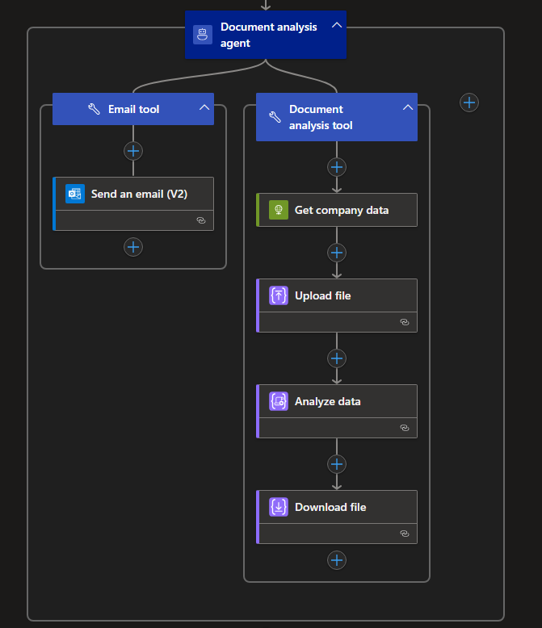
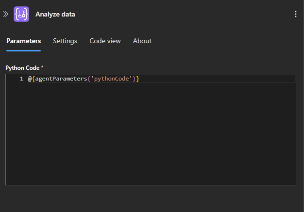

# Module 08 - Extend your tools with code

This module explains how to extend the functionality of Azure Logic Apps workflows and agents with built-in tools.

When finished with this module, you'll have gain the following knowledge:

- **Python Integration Capabilities**: How to leverage Python's data processing power within Logic Apps workflows for complex computations, statistical analysis, and structured data manipulation
- **LLM-Generated Code Execution**: How to enable agents to automatically convert natural language instructions into executable Python scripts, eliminating the need for manual coding expertise
- **End-to-End Data Analysis Automation**: How to build complete workflows that ingest data, perform analysis, generate reports with visualizations, and distribute results automatically
- **Multi-Language Code Support**: Understanding of how Python, JavaScript, C#, and PowerShell can be integrated into agent workflows for different computational needs

## Python for Data Analysis and Custom Computations

Python excels at handling structured data and performing complex computations within Logic Apps workflows, offering several key advantages:

### **Structured Data Processing**
- **JSON/XML Parsing**: Efficiently parse and manipulate complex nested data structures
- **Data Transformation**: Convert between formats, clean data, and reshape structures
- **Array Operations**: Process large datasets with built-in list comprehensions and filtering
- **Pattern Matching**: Use regular expressions and string manipulation for data extraction

### **Mathematical and Statistical Computations**
- **Statistical Analysis**: Calculate means, medians, standard deviations, and correlations
- **Business Logic**: Implement complex formulas for pricing, scoring, or risk calculations
- **Data Validation**: Perform custom validation rules that go beyond simple type checking
- **Aggregations**: Sum, count, group, and analyze data across multiple dimensions

### **Integration Benefits in Logic Apps**
- **Dynamic Logic**: Handle business rules that are too complex for native Logic Apps expressions
- **External Library Access**: Leverage Python's extensive ecosystem (pandas, numpy, etc.)
- **Custom Algorithms**: Implement proprietary calculations or machine learning models
- **Error Handling**: Robust exception handling for data processing operations

This section explores the Python code interpreter action in Logic Apps which bridges the gap between simple workflow automation and sophisticated data processing, enabling you to build intelligent agents that can reason about complex data patterns and perform advanced computations on demand.

## Using the Python action for user-written code
The Python code interpreter action can be add to standard workflows, enabling you to execute your own Python code. This integration is useful when you have custom code you want to run.

## Using the Python action for LLM-generated code
The Python code interpreter action can be integrated into agent workflows, enabling users to reference LLM-generated code directly as input for the action. This feature streamlines workflows by enabling natural language instructions to be automatically converted into executable Python scripts, allowing for rapid data analysis, cleaning, and visualization without the need for manual coding or advanced data science skills. Users do not need to be fluent in Python, and the generated code is designed to be accurate and executable. 

The example below demonstrates an agent workflow that leverages the Python code interpreter to analyze company sales data. The agent receives system instructions requesting a comprehensive sales data report with trend analysis and visualization. The workflow is structured around two primary tool branches:

{place_holder_for_video_guidance}

**Document Analysis Tool Branch:**
1. Ingests company data from Azure storage
2. Uploads the data to the Azure Container Apps Code Interpreter session
3. Executes LLM-generated Python code to analyze sales trends and create visualizations
4. Downloads the completed Python-generated report back into the workflow

**Email Tool Branch:**  
Automatically delivers the generated sales report to specified email recipients.

This architecture enables end-to-end automation of complex data analysis tasks, from data ingestion through report generation and distribution.

  
  
The Python code interpreter uses an agent paramater to pass LLM-generated code into the action.  

## How to use other custom code actions in agent context
The JavaScript, C#, and PowerShell actions can also be used within an agent workflow. The user can supply their own code or allow the LLM to generate it. 
- More on the JavaScript action: [Add and run JavaScript code inline with workflows for Azure Logic Apps](https://learn.microsoft.com/en-us/azure/logic-apps/add-run-javascript?tabs=standard)
- More on the C# action: [Add and run C# scripts inline with Standard workflows for Azure Logic Apps (Preview)](https://learn.microsoft.com/en-us/azure/logic-apps/add-run-csharp-scripts)
- More on the PowerShell action: [Add and run PowerShell scripts in Standard workflows for Azure Logic Apps (Preview)](https://learn.microsoft.com/en-us/azure/logic-apps/add-run-powershell-scripts)
