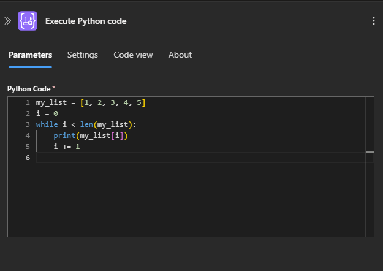

# Module 08 - Extend your tools with code

## Python for Data Analysis and Custom Computations

Python excels at handling structured data and performing complex computations within Logic Apps workflows, offering several key advantages:

### **Structured Data Processing**
- **JSON/XML Parsing**: Efficiently parse and manipulate complex nested data structures
- **Data Transformation**: Convert between formats, clean data, and reshape structures
- **Array Operations**: Process large datasets with built-in list comprehensions and filtering
- **Pattern Matching**: Use regular expressions and string manipulation for data extraction

### **Mathematical and Statistical Computations**
- **Statistical Analysis**: Calculate means, medians, standard deviations, and correlations
- **Business Logic**: Implement complex formulas for pricing, scoring, or risk calculations
- **Data Validation**: Perform custom validation rules that go beyond simple type checking
- **Aggregations**: Sum, count, group, and analyze data across multiple dimensions

### **Integration Benefits in Logic Apps**
- **Dynamic Logic**: Handle business rules that are too complex for native Logic Apps expressions
- **External Library Access**: Leverage Python's extensive ecosystem (pandas, numpy, etc.)
- **Custom Algorithms**: Implement proprietary calculations or machine learning models
- **Error Handling**: Robust exception handling for data processing operations

The Python code interpreter action in Logic Apps bridge the gap between simple workflow automation and sophisticated data processing, enabling you to build intelligent agents that can reason about complex data patterns and perform advanced computations on demand.

## Using the Python action for user-written code
The Python code interpreter action can be add to standard workflows, enabling users to execute their own Python code. This integration is useful when the user has custom code they want to run.

## Using the Python action for LLM-generated code
The Python code interpreter action can be integrated into agent workflows, enabling users to reference LLM-generated code directly as input for the action. This feature streamlines workflows by enabling natural language instructions to be automatically converted into executable Python scripts, allowing for rapid data analysis, cleaning, and visualization without the need for manual coding or advanced data science skills. Users do not need to be fluent in Python, and the generated code is designed to be accurate and executable. 

## How to use other custom code actions in agent context (this can be notes / links to docs)

The JavaScript executor action can also be used within an agent workflow. The user can supply their own JavaScript code or allow the LLM to generate it. More on the JavaScript action here: [Add and run JavaScript code inline with workflows for Azure Logic Apps](https://learn.microsoft.com/en-us/azure/logic-apps/add-run-javascript?tabs=standard)

## Maybe show how custom code can be used to implement guardrails if not already done above in tool pattern section
